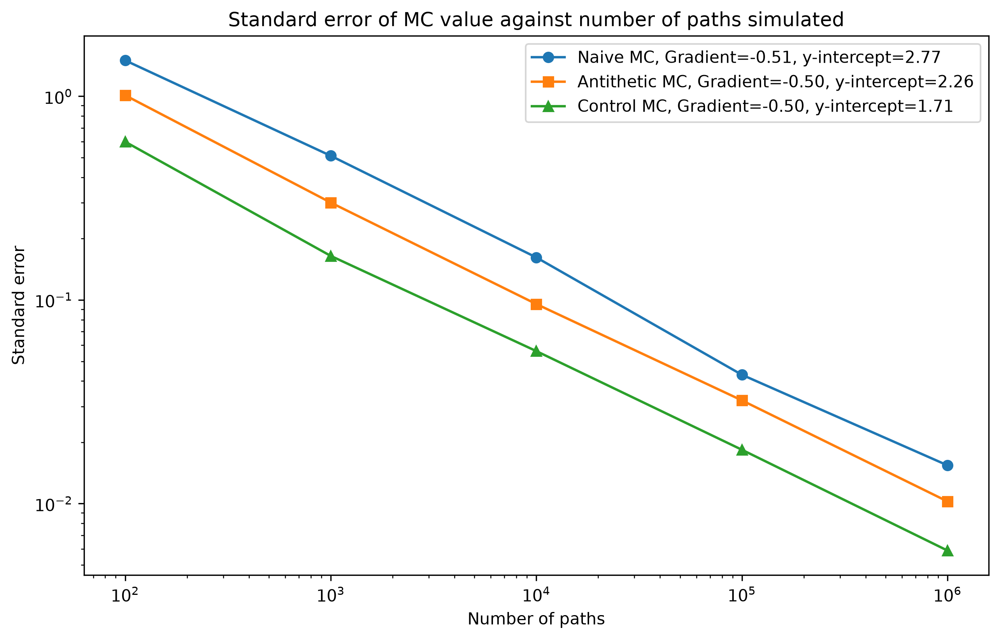

# Monte Carlo Simulation Options Pricer with Variance Reduction

The goal of this project was to use a Monte Carlo simulation to determine the fair price of a European call option under Black-Scholes framework assumptions.

## Key Results

This log-log graph (with gradient 1/2) confirms the $\mathcal{O}(N^{-1/2})$ convergence behaviour of the Monte Carlo algorithm and the decreasing y-intercepts show the effectiveness of the variance reduction techniques, 

---
### Results Table:

Analytical Price: £10.45

| Paths (N)    | Naive MC Error | Antithetic Error | Control Variates Error |
| ------------ | -------------  | ---------------- | ---------------------- |
| 100          | £1.1163        | £0.8237          | £0.4360
| 1000         | £0.3375        | £0.2626          | £0.1306
| 10000        | £0.0995        | £0.0798          | £0.0429
| 100000       | £0.0311        | £0.0274          | £0.0128
| 1000000      | £0.0113        | £0.0087          | £0.0047

## Mathematical Framework: